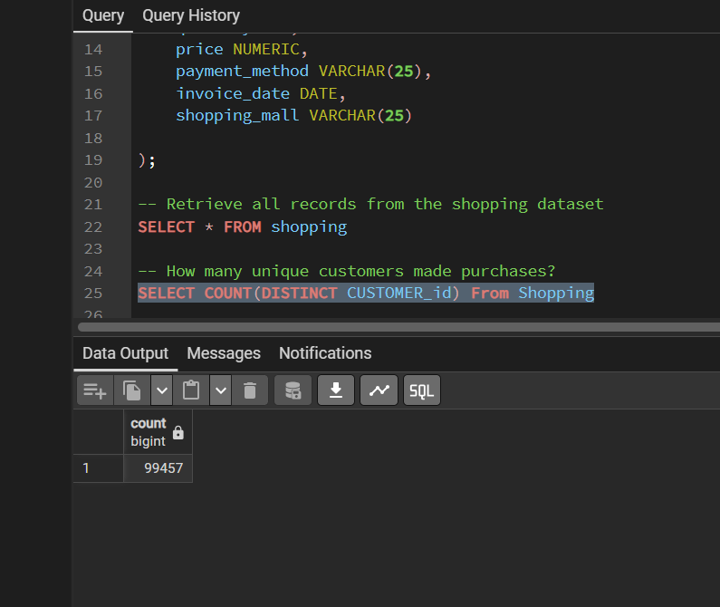
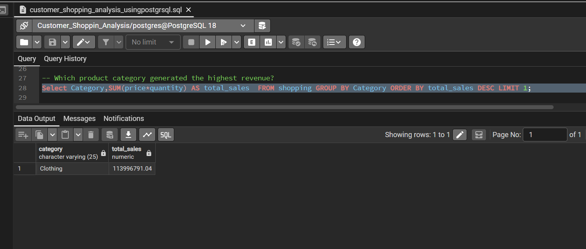
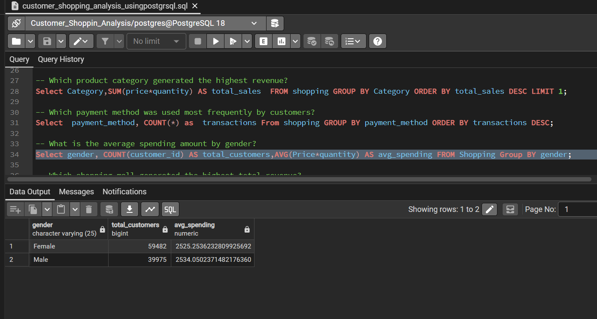
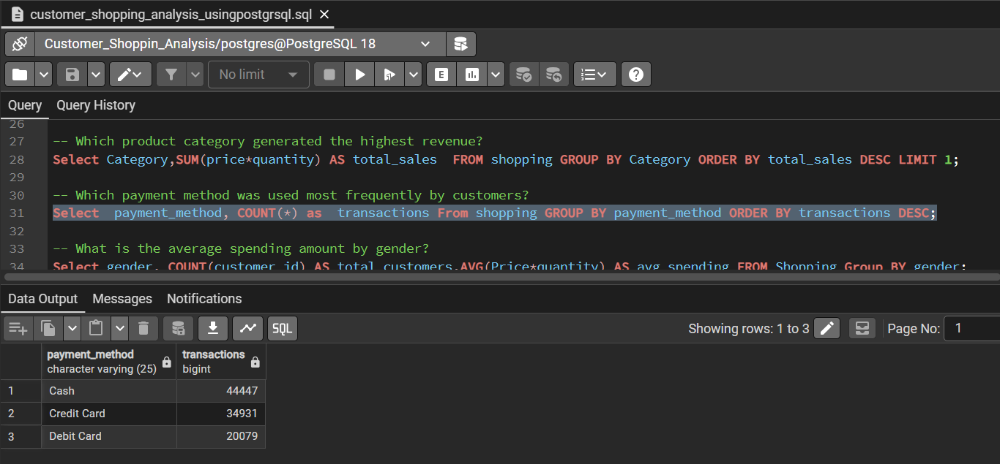
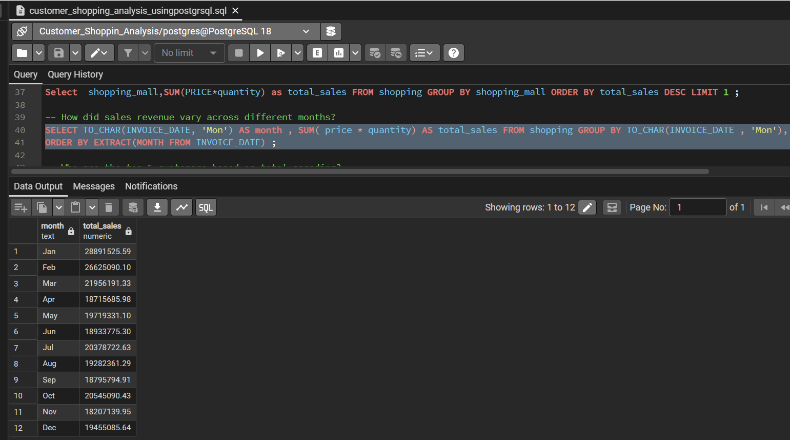
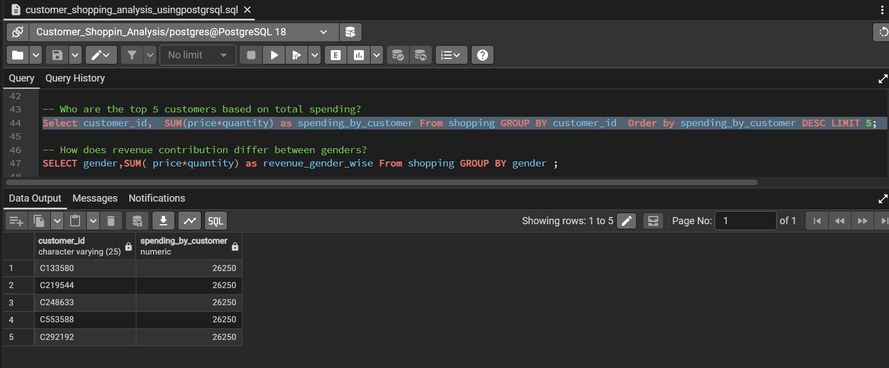
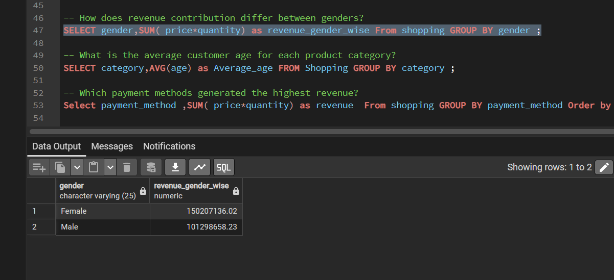
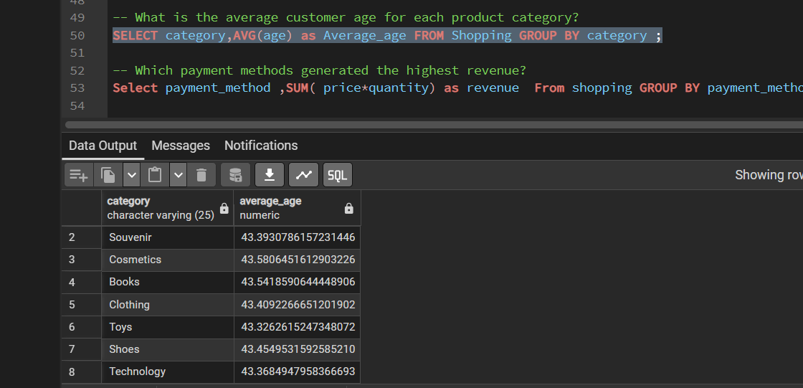

# Query Results & Screenshots
## Q1: How many unique customers made purchases?
### SELECT COUNT(DISTINCT CUSTOMER_id) From Shopping;

## Q2: Which product category generated the highest revenue?

## Q3: What is the average spending amount by gender?

## Q4: Which payment method was used most frequently?

## Q5: Which shopping mall generated the highest total revenue?

## Q6: How did sales revenue vary across different months?

## Q7: Who are the top 5 customers based on total spending?

## Q8: How does revenue contribution differ between genders?

## Q9: What is the average customer age for each product category?

## Q10: Which payment methods generated the highest revenue?

